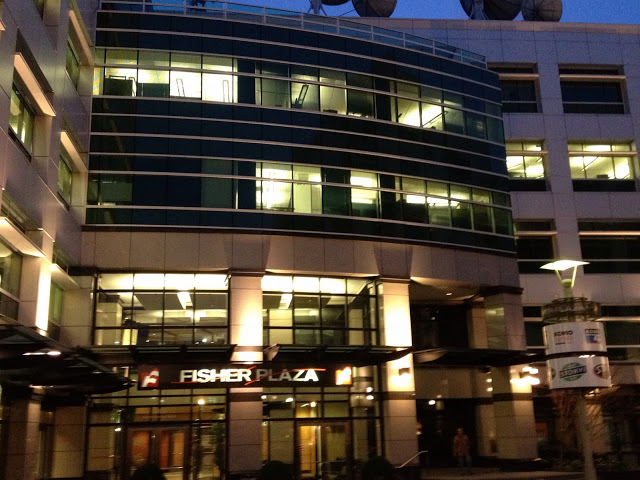

### Countdown: 11 weeks to race day

11 weeks until the day I swim, bike, and run at Lavaman to help cure cancer!

HAPPY NEW YEAR! I hope this year brings joy and happiness to you and your family.

Domo Arigato (thank you in Japanese), Mr. Roboto. FYI - this is my favorite robot.

Amy and I spent the New Year season in Japan. We spent time with Amy’s sister (Yuri) whom we haven’t seen in a LOOONNG time. It was the best New Years we’ve ever had, period.

We were in Tokyo for about a week, and I managed to get in one run. The straight line (pic below) is the route I was supposed to take, but I ended up zip zagging back and forth. Luckily, public transportation is awesome in Tokyo.

I often get asked from friends when/where I run, how I find my running routes, weather the cold, etc.

It’s rather simple. I just put on weather appropriate clothes, and just go (yes, even in the rain).

Do you remember Warcraft (release 1994)? This is the first and last Warcraft I played, so I have no frame of reference for the newer versions.

You first start out at your basecamp, and everything around you is pitch dark. The only way you can figure out what’s around you is to go and explore for yourself. And once you’re there, it remains ‘illuminated’ so you can slay your enemies. That’s much like what happens when I go for a run in a unfamiliar place. Fear of the unknown is my enemy, and I slay it by facing it head on. My geek friends will appreciate the Warcraft reference.

After the Tokyo trip, I have not been diligent in training, because my work has been kicking my butt lately. However, I got a great run couple of days ago. I got up at 6am, and off I went. I snapped some photos with my iPhone of the neighborhoods that I wanted to explore.

Started near Pike’s Market @ 6am.

Puget Sound @ Volunteer Park

Shot of the Space Needle from Volunteer Park

Ran up Queen Anne hill to Kerry Park (famous spot for photographs). I didn’t realize I was near this park until I was running past it. Check out the sunrise…AMAZING!

Ran back down to the Space Needle. Selfie!

For Grey’s Anatomy fans out there…here is the 'hospital’. Sssshhh, they don’t really work here…they’re in a studio in L.A.

Grabbed healthy 'Iced Grande Non-Fat No-whip Mocha’ for Amy, and some grub for later.

And finally, made it back home by 7:30am feeling energized.

Easy breezy. If I can do it, so can you! I hope you enjoyed views from my morning run in Seattle!

Thanks for your support, and if you haven’t already...**JOIN ME TO FIGHT CANCER!**

Keep on tri-ing!
Kenny
