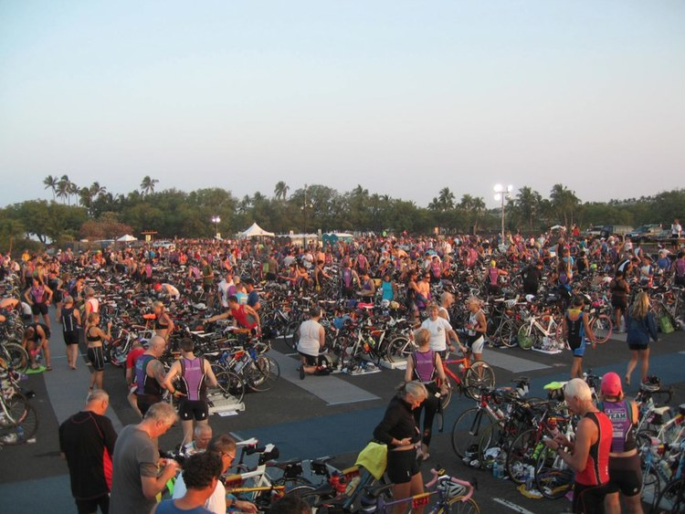

### Fundraising

Simply amazing. At the beginning of the race week, I was only at 80% of my fundraising $4,000 goal. By the end of the week, I was up 110% of my goal. Final fundraised amount = $4,390. WHOO-HOO! For those who supported this cause through donations, THANK YOU!

Our Washington/Alaska team raised over $240K, and 45 ppl trained/participated in Lavaman! Shoutout to my teammates, Liesel, Tarang, and Janet, who were 3 of top 10 fundraisers in the country! AMAZING!

Team in Training (TNT) as a whole raised over $2.5M, and over 540 TNT fundraisers competed in Lavaman (1200+ ppl including non-TNT participants). It was quite a sight to see a sea of purple all fundraising to cure blood cancers!

### Impact

During/between meals, training sessions, and team meetings, I was able to hear incredible stories of teammates’ personal stories related to cancer.

Survivors, dad/mothers, daughters/sons, grandparents, relatives, friends of cancer survivors or lost ones, all had incredible stories to share that fueled my motivation.

Everyone knows that I don’t usually get emotional, but some of these incredible stories make me…well you know…

I want to recap why we’re fundraising. I know some of you just donated b/c I twisted your arm (and I appreciate that), but here is where your hard earned dollars are going:

The Leukemia & Lymphoma Society (LLS) is the world’s largest voluntary health agency dedicated to blood cancer.

The LLS mission: Cure leukemia, lymphoma, Hodgkin’s disease and myeloma, and improve the quality of life of patients and their families.

Nearly 50% of all cancer drugs approved by the FDA during the past decade were for blood cancers. And they are helping other patients as well. Five of those drugs have been approved for patients with solid tumors and others are being tested for other indications.

There are 3 main areas the LLS supports (click links below if you want to learn more):

- Research
- Patient Services
- Public Policy

Here is a question that you might want to ask, but are afraid to, or don’t want to be douchey.

Question: LLS/TNT raises so much money, are we close to a cure yet? Can you stop asking me for donations?

Answer: How can you ask a cancer survivor that question? If you are reading this blog, you’re screwed…you’re on my donation list until we find a cure. Just kidding…well actually, not really.

But seriously, here are the facts as of 2012.

- Every 4 minutes, one person in the United States is diagnosed with a blood cancer.
- Every 10 minutes, someone in the US dies from a blood cancer.

I will keep asking for your support until there is a cure, and this mean a lot to me. There is no obligation, but even a small donation makes a difference.

### My 1st Triathlon - Lavaman 2012

<!--  -->

### I had 2 goals

1. Finish the race
1. Don’t finish last in my age group

I accomplished both of these lofty goals. You wouldn’t have believed that I could reach these goals if you watched my first swim practice.

### Swim: 1.5K/0.9 miles - Time = 38:34

Swim felt good. Surprisingly good.

When your “wave” (usually grouped by age) begins the race, people are slamming into each other, kicking and elbowing.

But once you’re out there, it just becomes you, the ocean, marine life (fish, sea turtles), and the occasional “Was that a shark fin?” or “Why did the water get warm all of a sudden?….oh no, close your mouth!”

### Bike: 40K/25 miles - Time = 1:31:17

Going downhill - Eazy-breezy. I have a heavy frame, so I’m like a Mack truck speeding past light-weight skinny folks. See you later skinny…WHA-HAHAHAH!!!

Going uphill - Gah…I struggle here. Skinny or not, everyone passes me going uphill. I have weak legs. My cousin once told me that I’m like Mr. Potato Head…fat head, skinny limbs - I was 10 yrs old for god sake. Emotional scars…

I don’t have “Mr. Potato Head riding on bike” picture. But, here is what it feels to be part of the pre-race bike crowd when we’re all setting up and preparing for the race.

### Run: 10K/6.2 miles - Time = 1:09:51

I ran a marathon a couple of years ago…and I managed to run the entire 26.2 miles. So this should be cake, right? Wrong…I ended up running much slower than my usual pace.

Stumbling through a lavafield, unshaded road with sun beating down your back, then finishing on a sandy/rocky beach path during the last 1.5 mile was not easy. I shoved ice under my hat and shirt at each opportunity. It’s highly recommended.

By the time I reached the finish line, I looked like a sunburnt Oompa Loompa. BUT, I also felt great afterwards!

### Total Race Time = 3:24:48 (h:mm:ss)

### Conclusion

I learned how to swim/bike/run together for the 1st time. I made new friends, and I tried something I’ve never done before…and it feels AWESOME! It was definitely a challenge, but it was totally worth it, and makes me feel more alive!

Special thanks to Amy for supporting me and massaging me throughout the training season; my parents who sent special prayers so that I don’t drown; thanks to my mentors Anika and Dorothy; captains Ande and Louisa; coaches Cathy and Fred; friends whom I freeloaded rides from after practices (esp., Ben, Erika, Sandy); all of the new TNT friends who gave me guidance and support; and finally, thanks to those who donated to this great cause, and supporters who read this blog!

Now it’s your turn to try something new, and share your experiences with me! I would love to live vicariously through you!

Lastly and most importantly, all of this is for a great cause! We’re training/fundraising to save lives and cure cancer!

Thank you for sharing my 1st triathlon journey with me. It has been a wild, fun ride. Until next time…

Keep on tri-ing,
Kenny
